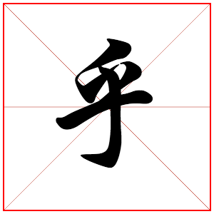

# Mute Zhihu

> mute_zhihu(低调浏览知乎插件)

  

## :mahjong: 已完成功能 

- [x] 自动识别目标网站zhihu.com
- [x] 按钮去色  
- [x] 问题标题去掉加粗  
- [x] 点赞按钮去色  
- [x] 按钮的蓝色边框  
- [x] 隐藏知乎logo  
- [x] 隐藏相关推荐和相关问题  
- [x] 隐藏通知按钮，消息按钮   

## :rocket: Todo 

- [ ] 用户可对任意网页的class设置隐藏功能  
- [ ] 记忆用户设置的隐藏选项，并自动隐藏，第二次无需操作  

#### 实验网页

- [知乎:如何从零开始写一个 Chrome 扩展？](https://www.zhihu.com/question/20179805)

#### 参考

- [介绍:https://developer.chrome.com/extensions](https://developer.chrome.com/extensions)
- [官方示例:https://developer.chrome.com/extensions](https://developer.chrome.com/extensions)
